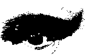
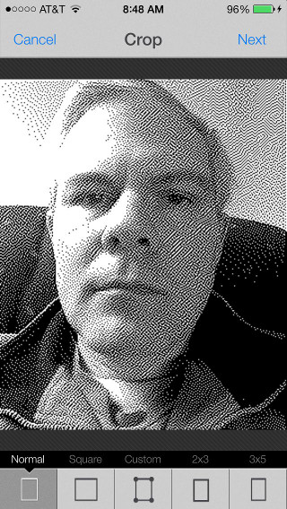

Dot-Cam
=======

Dot-Cam Retro Cam is an iPhone camera app that filters the camera using several 1-bit filters. All images contain only 2 colors - black or white. It is amazing what dithers can do with only 2 colors.

Atkinson filter. This is the filter used on the original Apple Screens, when they could only display black or white pixels.
B&W. No dithering, but thresholds the camera image to either black or white pixels.

The threshold levels for all filters can be adjusted by running your finger up and down the image.

NOTE: You will need to download the RadiumOne Photo Effects SDK from http://effects.radiumone.com/

Screen shots:

